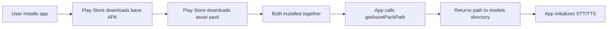

## Overview

**Play Asset Delivery (PAD)** allows you to distribute large model files (often 100MB+) separately from your main APK. This keeps your base APK small while still providing models to users at install time.

PAD is especially useful for:
- **Large STT models** (e.g., Whisper, Paraformer with 100MB+ ONNX files)
- **Multiple TTS voices** (each VITS model can be 20-50MB)
- **Reducing initial APK size** (base APK stays under 100MB, models delivered separately)

## How It Works

1. **Asset Pack Module:** Models are placed in a separate Gradle module (e.g., `android/sherpa_models/`)
2. **Install-Time Delivery:** Google Play delivers the asset pack **with** the app installation (no separate download)
3. **Runtime Access:** Your app retrieves the unpacked model directory path via `getAssetPackPath()`
4. **Model Discovery:** Use `listModelsAtPath()` to find available models in the pack



## Setup

### 1. Create Asset Pack Module

In your app's `android/` directory, create a new Gradle module for models:

```sh
mkdir -p android/sherpa_models/src/main/assets/models
```

### 2. Configure Asset Pack Module

Create `android/sherpa_models/build.gradle`:

```gradle
plugins {
    id 'com.android.asset-pack'
}

assetPack {
    packName = "sherpa_models"  // Must match getAssetPackPath() argument
    dynamicDelivery {
        deliveryType = "install-time"  // Delivered with app installation
    }
}
```

### 3. Add Models to Asset Pack

Place your models in the asset pack's assets directory:

```
android/sherpa_models/src/main/assets/models/
├── sherpa-onnx-whisper-tiny-en/
│   ├── encoder.onnx
│   ├── decoder.onnx
│   └── tokens.txt
├── vits-piper-en_US-lessac-low/
│   ├── model.onnx
│   └── tokens.txt
└── paraformer-zh/
    ├── model.int8.onnx
    └── tokens.txt
```

<Note>
  Use the same folder structure as bundled assets: `models/` as the root, with each model in its own subdirectory.
</Note>

### 4. Reference Asset Pack in App Module

In your app's `android/app/build.gradle`, add:

```gradle
android {
    // ...
    assetPacks = [":sherpa_models"]
}
```

### 5. Include Asset Pack in Settings

In `android/settings.gradle`, add:

```gradle
include ':app'
include ':sherpa_models'
project(':sherpa_models').projectDir = new File(rootProject.projectDir, 'sherpa_models')
```

## Runtime Usage

### Getting the Asset Pack Path

```typescript
import { getAssetPackPath } from 'react-native-sherpa-onnx';

const packPath = await getAssetPackPath('sherpa_models');

if (packPath) {
  console.log('Models directory:', packPath);
  // Example: /data/app/~~abc123==/com.example.app/asset_packs/sherpa_models/assets/models
} else {
  console.log('Asset pack not available (app not installed via Play Store)');
}
```

**Returns:**
- **`string`** - Absolute path to the asset pack's unpacked content directory
- **`null`** - Asset pack not available (debug builds without PAD, or iOS)

<Warning>
  `getAssetPackPath()` returns `null` on iOS and on Android debug builds unless you explicitly install with the asset pack (see [Building with PAD](#building-with-pad) below).
</Warning>

### Listing Models in Asset Pack

```typescript
import { getAssetPackPath, listModelsAtPath } from 'react-native-sherpa-onnx';

const packPath = await getAssetPackPath('sherpa_models');
if (!packPath) {
  console.log('Using fallback directory');
  // Fall back to DocumentDirectoryPath or bundled assets
  return;
}

const models = await listModelsAtPath(packPath);
const sttModels = models.filter(m => m.hint === 'stt');
const ttsModels = models.filter(m => m.hint === 'tts');

console.log('STT models:', sttModels.map(m => m.folder));
console.log('TTS models:', ttsModels.map(m => m.folder));
```

**Returns:** Array of `{ folder: string, hint: 'stt' | 'tts' | 'unknown' }`

### Initializing with Asset Pack Models

```typescript
import { getAssetPackPath } from 'react-native-sherpa-onnx';
import { initializeSTT } from 'react-native-sherpa-onnx/stt';
import { initializeTTS } from 'react-native-sherpa-onnx/tts';

const packPath = await getAssetPackPath('sherpa_models');
if (!packPath) throw new Error('Asset pack not available');

// User selected a model folder (e.g., from listModelsAtPath)
const selectedFolder = 'sherpa-onnx-whisper-tiny-en';
const fullPath = `${packPath}/${selectedFolder}`;

// Initialize STT with file path
await initializeSTT({
  modelPath: { type: 'file', path: fullPath },
  modelType: 'auto',  // Auto-detect from files
});

// Or TTS:
const ttsFolder = 'vits-piper-en_US-lessac-low';
const ttsPath = `${packPath}/${ttsFolder}`;
await initializeTTS({
  modelPath: { type: 'file', path: ttsPath },
  modelType: 'auto',
});
```

<Note>
  Use `type: 'file'` (not `type: 'asset'`) for asset pack models, since they're on the filesystem after unpacking.
</Note>

## Building with PAD

### Release Build (AAB)

PAD requires an **Android App Bundle (AAB)** for distribution via Google Play:

```sh
cd android
./gradlew bundleRelease
```

Output: `android/app/build/outputs/bundle/release/app-release.aab`

Upload this AAB to Google Play Console. Play Store will deliver the asset pack automatically when users install your app.

### Debug Build with PAD

For local testing with PAD, you need **bundletool** to build an APK set from the AAB:

#### Install bundletool

Download from [GitHub Releases](https://github.com/google/bundletool/releases):

```sh
wget https://github.com/google/bundletool/releases/download/1.15.6/bundletool-all-1.15.6.jar
```

Or via Homebrew (macOS):

```sh
brew install bundletool
```

#### Build and Install APKs with PAD

**Option 1: Using Gradle task** (if configured in your app):

```sh
cd android
./gradlew installDebugWithPad
```

**Option 2: Manual bundletool**:

```sh
# 1. Build the AAB
cd android
./gradlew bundleDebug

# 2. Generate APK set
bundletool build-apks \
  --bundle=app/build/outputs/bundle/debug/app-debug.aab \
  --output=app/build/outputs/apk/debug/app-debug.apks \
  --local-testing

# 3. Install to connected device
bundletool install-apks \
  --apks=app/build/outputs/apk/debug/app-debug.apks
```

#### Using Metro with PAD Debug Build

After installing the APK set with PAD:

1. **Start Metro bundler:**
   ```sh
   yarn start
   ```

2. **Enable reverse port forwarding** (so the app can reach Metro):
   ```sh
   adb reverse tcp:8081 tcp:8081
   ```

3. **Launch the app** on your device

The app will load the base APK (with asset pack) from the device, but fetch JavaScript from Metro for fast refresh.

## Fallback Strategy

Always provide a fallback when the asset pack isn't available (e.g., debug builds, iOS):

```typescript
import { getAssetPackPath, listModelsAtPath, listAssetModels } from 'react-native-sherpa-onnx';
import { DocumentDirectoryPath } from '@dr.pogodin/react-native-fs';

const getModelsDirectory = async () => {
  // 1. Try Play Asset Delivery
  const padPath = await getAssetPackPath('sherpa_models');
  if (padPath) return { path: padPath, type: 'file' as const };

  // 2. Fall back to downloaded models in app directory
  const downloadPath = `${DocumentDirectoryPath}/models`;
  if (await RNFS.exists(downloadPath)) {
    return { path: downloadPath, type: 'file' as const };
  }

  // 3. Fall back to bundled assets (small models only)
  return { path: 'models', type: 'asset' as const };
};

const { path, type } = await getModelsDirectory();
const models = type === 'asset' 
  ? await listAssetModels()
  : await listModelsAtPath(path);
```

## Best Practices

### 1. Install-Time vs. On-Demand

- **Install-Time** (recommended): Asset pack delivered with app installation
  ```gradle
  deliveryType = "install-time"
  ```

- **On-Demand**: Asset pack downloaded when requested (requires extra code)
  ```gradle
  deliveryType = "on-demand"
  ```

<Note>
  Install-time delivery is simpler and ensures models are available immediately. On-demand delivery requires implementing download UI and error handling.
</Note>

### 2. Size Limits

- **Install-time asset packs:** 1GB total across all packs
- **On-demand asset packs:** 512MB per pack, 2GB total

For models larger than these limits, use the [Model Download Manager](/models/download-manager) to download models after installation.

### 3. Multiple Asset Packs

You can create separate packs for STT and TTS:

```gradle
// android/settings.gradle
include ':stt_models'
include ':tts_models'

// android/app/build.gradle
android {
    assetPacks = [":stt_models", ":tts_models"]
}
```

```typescript
const sttPath = await getAssetPackPath('stt_models');
const ttsPath = await getAssetPackPath('tts_models');
```

### 4. Testing Locally

Always test PAD builds **before** uploading to Play Store:

```sh
# Build AAB with asset packs
cd android
./gradlew bundleDebug

# Generate and install APK set
bundletool build-apks --bundle=app/build/outputs/bundle/debug/app-debug.aab \
  --output=app-debug.apks --local-testing
bundletool install-apks --apks=app-debug.apks

# Verify asset pack path
adb shell run-as com.yourapp.package ls -la /data/app/.../asset_packs/sherpa_models/
```

## Troubleshooting

### `getAssetPackPath()` returns `null`

**Causes:**
- App was not installed from an AAB (e.g., via `./gradlew installDebug`)
- Asset pack name in `build.gradle` doesn't match `getAssetPackPath()` argument
- Asset pack module not included in `settings.gradle`
- Running on iOS (PAD is Android-only)

**Solution:**
Install via bundletool with `--local-testing` (see [Debug Build with PAD](#debug-build-with-pad)).

### Models directory is empty

**Causes:**
- Models weren't placed in `sherpa_models/src/main/assets/models/`
- Asset pack wasn't rebuilt after adding models

**Solution:**
```sh
cd android
./gradlew clean
./gradlew bundleDebug
# Reinstall via bundletool
```

### Asset pack not delivered on Play Store

**Causes:**
- `deliveryType` is `on-demand` but download wasn't triggered
- Asset pack size exceeds limits
- Play Store configuration issue

**Solution:**
1. Use `install-time` delivery for automatic installation
2. Check Play Console → Release → Asset Packs for status
3. Verify AAB was uploaded correctly

### bundletool not found

**Error:** `bundletool: command not found`

**Solution (Gradle):**
Pass bundletool path explicitly:
```sh
./gradlew installDebugWithPad -Pbundletool=/path/to/bundletool-all.jar
```

**Solution (PATH):**
Add bundletool to your PATH:
```sh
export PATH="$PATH:/path/to/bundletool"
```

## Combining PAD with Bundled Assets

You can ship small models in bundled assets and large models in PAD:

```typescript
import { listAssetModels, listModelsAtPath, getAssetPackPath } from 'react-native-sherpa-onnx';

const getAllModels = async () => {
  const bundledModels = await listAssetModels();
  const padPath = await getAssetPackPath('sherpa_models');
  const padModels = padPath ? await listModelsAtPath(padPath) : [];

  return [
    ...bundledModels.map(m => ({ ...m, source: 'bundled' as const })),
    ...padModels.map(m => ({ ...m, source: 'pad' as const })),
  ];
};

const models = await getAllModels();
console.log(`Found ${models.length} models total`);
```

Then initialize based on source:

```typescript
const initializeModel = async (model: ModelInfo) => {
  if (model.source === 'bundled') {
    await initializeSTT({
      modelPath: { type: 'asset', path: `models/${model.folder}` },
      modelType: 'auto',
    });
  } else {
    const padPath = await getAssetPackPath('sherpa_models');
    if (!padPath) throw new Error('PAD not available');
    await initializeSTT({
      modelPath: { type: 'file', path: `${padPath}/${model.folder}` },
      modelType: 'auto',
    });
  }
};
```

## Related Documentation

- [Model Setup](/models/setup) - Asset bundling and filesystem models
- [Model Download Manager](/models/download-manager) - Download models at runtime
- [Android Setup](/platform/android) - Gradle configuration
- [Google Play Asset Delivery Guide](https://developer.android.com/guide/playcore/asset-delivery) - Official Android documentation
